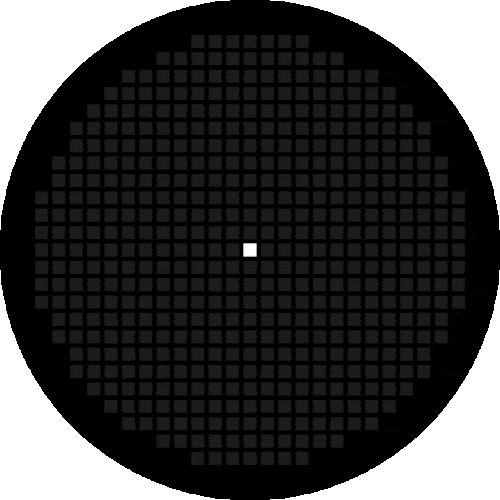

# Endless Life



Conway's Game of Life for the Nothing Phone (3) Glyph Matrix.

## Features

- Runs continuous simulations (supports Always-on / Flip to Glyph)
- Time-seeded initial random patterns
- Automatic detection of stable or extinct states
- Multiple starting reveal animations
- Long press on the Glyph button triggers a new life
- User-adjustable animation selection, speed, and density

## Requirements

- Nothing Phone (3)
- Glyph Matrix SDK 2.0 AAR

## Installation

1. Add the Glyph Matrix SDK to `app/libs/`.
2. Build and install the app.
3. Enable **Endless Life** in Glyph Interface → Glyph Toys.
4. Recommended: Set as the Always-on Glyph Toy under Flip to Glyph.

## Settings

The app includes a settings screen with:
- Selection of starting animations
- Simulation speed
- Initial cell density
- Resume behavior after unbind

Long-press the Glyph button at any time to force a new life.

## Project Structure

```
app/src/main/java/com/theivan/endlesslife/
├── EndlessLifeService.kt     # Main toy service
├── LifeGameEngine.kt         # 25×25 Conway engine
├── PatternGenerator.kt       # Time-seeded patterns
├── StabilityDetector.kt      # Stable/extinct detection
├── StartingAnimation.kt      # Reveal animations
├── EndingAnimation.kt        # Fade transition
├── GlyphRenderer.kt
├── MainActivity.kt           # Settings UI
└── ...
```

## Credits

Based on concepts from [Yuma-Eimymk2/glyph-life](https://github.com/Yuma-Eimymk2/glyph-life).  
Images generated by the excellent [pauwma/GlyphMatrixEditor](https://github.com/pauwma/GlyphMatrixEditor).

MIT License.
